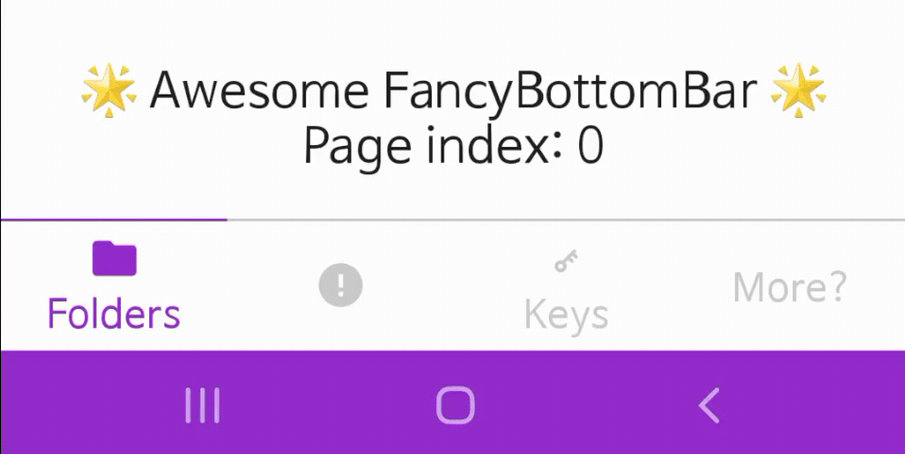

# FancyBottomBar [](https://search.maven.org/artifact/io.github.jisungbin/fancybottombar)

An awesome fancy bottom-bar library for Jetpack Compose.

-----

# Download
```groovy
implementation "io.github.jisungbin:fancybottombar:${version}"
```

# Usage
// todo

---

# 🤗 Happy Coding :)
